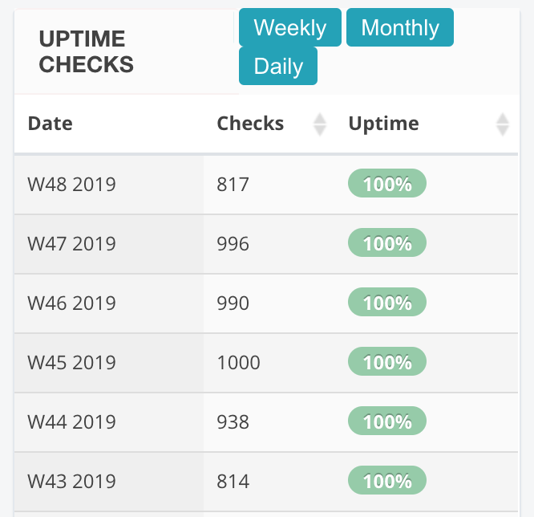

**Har du ustabilt internett? Det spurte styret i borettslaget. Da måtte jeg jo måle det.**

Jeg er nok en litt mer avansert bruker av bredbånd. Dermed har jeg også litt mer avansert oppsett for å komme meg på nett. Ikke at det betyr noe for bruken i det daglige.

Dermed kunne jeg veldig raskt gjøre en liten helsesjekk for å se om systemene mine hadde oppdaget noe.

### Stabilitet med fast pingsjekk

Oppkoblingen til internett hos meg går via en egen kablet ruter som kjører [`pfsense`](https://docs.netgate.com/pfsense/en/latest/).

Det er en mer avansert ruter-programvare som gjør at jeg blant annet kan dele opp nettverket i flere ulike oppdelte nettverk. Dermed kan robotstøvsugeren, tv-dekoderen, smart-tv-en og annet IoT-greier være på et eget nettverk. Jeg har også et eget nettverk for gjester.

En annen fordel med pfsense er at systemet måler kvaliteten på internett-tilkoblingen ved å måle stabilitet fortløpende.

Dette gjøres ved å sende gjentatte `ping`. Som standard sender ruteren ping til nærmeste punkt hos internett-leverandøren (gateway). Dette vil dog ikke oppdage om det er noe feil hos leverandøren som gjør at jeg ikke når resten av internett.

Jeg har derfor satt opp ruteren til å sjekke stabiliteten mot en adresse i internettsentralen NIX.

Ruteren genererer statistikk fortløpende som sier noe om tiden det tar fra meg til internettsentralen (latency), og om det er noen utfall (pakketap).

Da jeg så at borettslaget lurte på om det var ustabilitet sjekket jeg derfor tallene for de siste ukene.

Da kunne jeg se noe som så ut som et tydelig utfall den 27. september.

En nærmere undersøkelse av dataene for akkurat den dagen viste et utfall enten på min linje eller i andre enden på noen timer.

Ellers virker bredbåndet mitt å være veldig stabilt, og med fiberlinje er tiden bruker til NIX svært kort. Her er noen tall for de to siste ukene (med oppløsning på 1 time).

| Variabel        | Snitt         | Minimum       | Maksimum      |
| --------------- | ------------- | ------------- | ------------- |
| pakketap        |         0,01% |         0,00% |         2,76% |
| ping (latency)  | 1,13 ms       | 1,07 ms       | 3,01 ms       |

### Oppdage at nettet er nede

Èn ting jeg stusset på da jeg sjekket dette var at jeg hadde jo ikke selv oppdaget at nettet var nede i noen timer. Mest sannsynlig hadde jeg vært på jobb da leiligheten var uten internett i en periode.

_Ruteren min kan sende beskjed om at den har manglet internett, men den får jo ikke sendt noe før problemet er løst. Når den ikke har internett får den ikke sendt noen varsel._

Dermed begynte jeg å undersøke muligheter for å overvåke internettlinjen slik at jeg får beskjed i det den går ned.

Da landet jeg jeg på en overvåkingstjeneste fra [`statuscake.com`](https://www.statuscake.com/)

Systemet kalles for `push test` og innebærer at systemet deres forventer at en bestemt adresse besøkes med jevne mellomrom.

Min ruter er satt til å spørre om den spesielle adressen hvert femte minutt. Om det ikke har blitt spurt om adressen på ti minutt går alarmen, og jeg får et varsel fra statuscake om at nettet i leiligheten virker å ha mistet tilgangen til internett.

Å få en pfsense-ruter til å spørre en slik addresse med jevne mellomrom er ganske enkelt. Man installerer bare pakken for å redigere planlagte oppgaver (`cron`) i det grafiske brukergrensesnittet. Så legger man inn en slik linje som dette:

`/5	*	*	*	* /usr/bin/fetch -q 'https://push.statuscake.com/?unikspesielladrese'`

En del andre rutere kan nok også gjøre dette. F.eks. kan de fleste Asus-rutere gjøre slike planlagte jobber – i alle fall om man kjører en litt mer avansert versjon av programvaren til ruteren kalt [`asuswrt-merlin`](https://github.com/RMerl/asuswrt-merlin/wiki/Scheduled-tasks-(cron-jobs))
Da vil man fort bruke `curl` som er mer vanlig i Linux i stedet for `fetch` som er vanlig i BSD-systemer som pfsense er.

Siden jeg satte opp overvåkingen av linjen har den vært veldig stabil, og ikke meldt om nedetid over ti minutter.

Her sees info om oppetid per uke:

